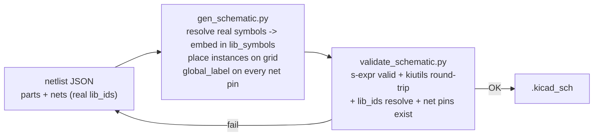

# KiCad schematic PoC - AD7380 application circuit

Proof of concept: an agent generating a real `.kicad_sch` that wires up **actual
KiCad library components** around the AD7380BCPZ-RL symbol we built one level up.

## What it produces

`ad7380_app.kicad_sch` - the AD7380 with full decoupling (VCC/VLOGIC/REGCAP/
REFCAP/REFIO caps) and an 8-pin SPI breakout header, using real
`Device:C` and `Connector_Generic:Conn_01x08` symbols plus our custom
`Custom:AD7380BCPZ-RL`.

```
7 parts, 11 nets, 31 pin-connections  ->  ALL CHECKS PASSED
```

## The approach

Same model->data->validate split as the symbol PoC, with one big idea that makes
schematic generation tractable:

**Connect by net labels, not wire routing.** Each pin on a net gets a
`global_label` with the net's name, placed exactly on the pin. KiCad merges
same-named global labels into one net - so component layout is free and there is
no fragile wire-to-pin geometry. The agent only decides the *netlist* (what
connects to what); the code resolves real symbols, places them on a grid, and
drops the labels.



## Files

- `gen_schematic.py` - netlist -> `.kicad_sch` (real symbols, grid place, labels).
- `validate_schematic.py` - structural + netlist-match validation.
- `ad7380_app.netlist.json` - the PoC netlist (the "data" the agent reasons out).
- `preview_sch_svg.py` - renders the netlist to SVG for visual sanity.
- `ad7380_app.kicad_sch` / `ad7380_app_preview.svg` - generated outputs.

## Run

```bash
git clone --depth 1 https://gitlab.com/kicad/libraries/kicad-symbols.git /tmp/kicad-symbols
pip install kiutils sexpdata
python3 gen_schematic.py ad7380_app.netlist.json ad7380_app.kicad_sch
python3 validate_schematic.py ad7380_app.kicad_sch --spec ad7380_app.netlist.json
python3 preview_sch_svg.py ad7380_app.netlist.json   # -> ad7380_app_preview.svg
```

## Coordinate transform (the one subtle bit)

Symbol libraries are Y-up; schematics are Y-down. A library pin at `(x, y)` on an
instance placed at `(px, py)` lands at `(px + x, py - y)` in schematic space.
Instances are placed unrotated so this stays exact. Get this wrong and labels
miss their pins.

## Honest limits

- Validation is structural + kiutils round-trip - it does NOT run electrical
  **ERC**. No `kicad-cli` in this container, so the label-on-pin connectivity is
  computed with the standard transform but not yet confirmed by KiCad itself.
  Next step for real confidence: bake `kicad-cli` and run `kicad-cli sch erc`.
- Auto-placement is a grid, not a pretty layout - functional, human tidies it.
- The 4 analog input pins (AINA/AINB) are intentionally left unconnected (they go
  to the sensor in a real design).
- Target KiCad 7+; format version may need bumping. Open it and run ERC to confirm.
